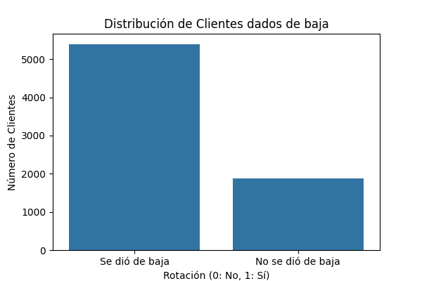
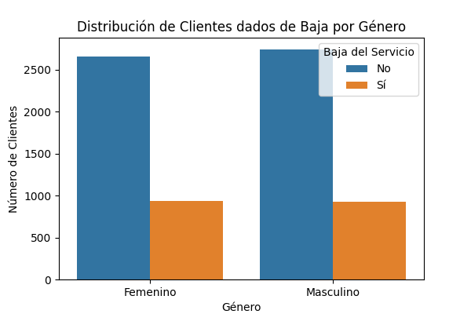
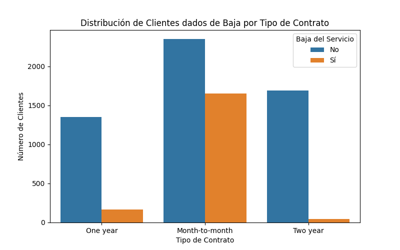
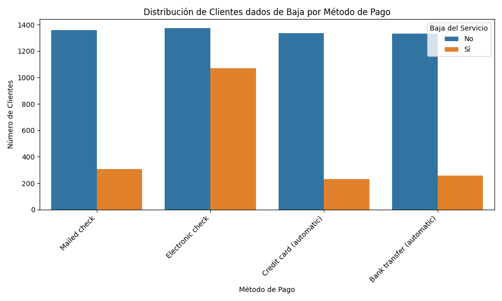
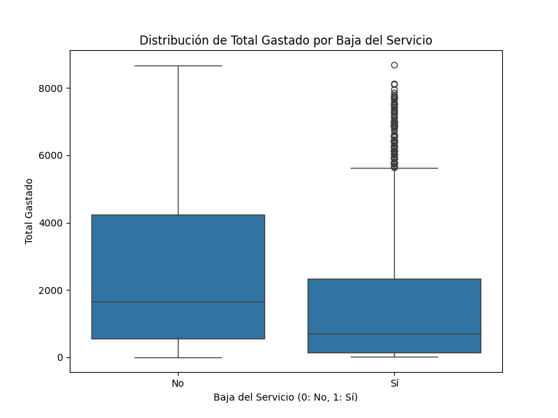
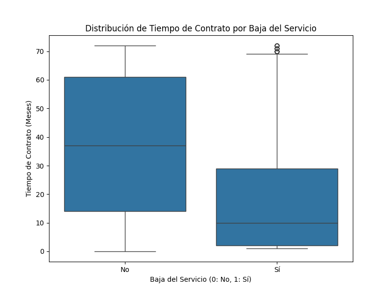
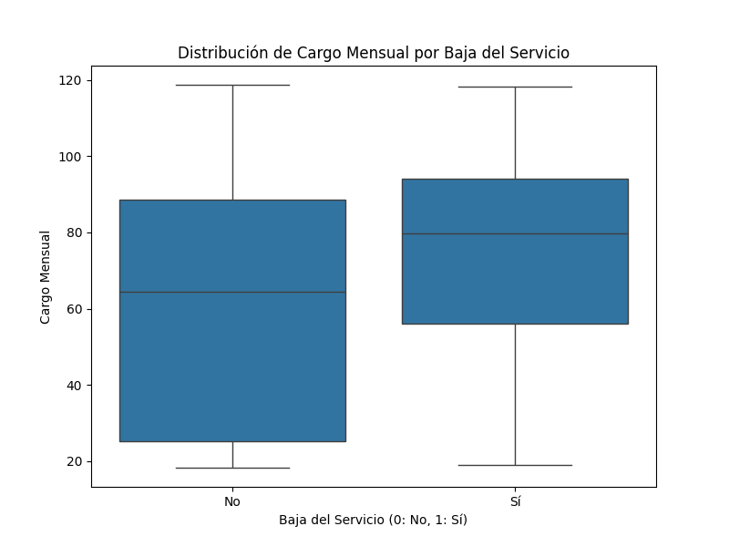

# Análisis por Baja de Servicio de Clientes (Churn) en TelecomX

## Introducción

Este proyecto realiza un análisis exploratorio de datos sobre un conjunto de datos de clientes de TelecomX con el objetivo de identificar los factores que influyen en la baja del servicio (Churn). Comprender por qué los clientes se van es crucial para desarrollar estrategias de retención efectivas y mejorar la rentabilidad del negocio.

El análisis abarca los siguientes pasos:

- Carga y normalización de los datos.
- Limpieza y tratamiento de valores nulos y tipos de datos.
- Creación de nuevas características relevantes.
- Análisis exploratorio de datos para identificar patrones y relaciones entre variables y la rotación de clientes.
- Extracción de conclusiones e insights clave.
- Propuesta de recomendaciones estratégicas basadas en los hallazgos.

## Estructura del Proyecto

El análisis se encuentra documentado en un cuaderno de Google Colab.

## Datos

El conjunto de datos utilizado proviene de un archivo JSON y contiene información detallada sobre los clientes de TelecomX, incluyendo datos demográficos, servicios contratados, información de facturación y el estado de rotación (Churn).

## Limpieza y Tratamiento de Datos

Se realizaron las siguientes operaciones de limpieza y transformación en los datos:

- Normalización de estructuras anidadas en el JSON.
- Conversión de la columna 'Charges.Total' a tipo numérico, manejando errores.
- Imputación de valores nulos en 'Charges.Total' con 0.0.
- Reemplazo de strings vacíos en 'Churn' con 'No'.
- Creación de la característica 'Cuentas_Diarias' (`Charges.Monthly / 30`).
- Codificación numérica de variables categóricas binarias ('Yes'/'No' y variaciones).

## Análisis Exploratorio de Datos (EDA)

Se exploró la distribución de la rotación de clientes y su relación con diversas variables. Los hallazgos clave se presentan a través de visualizaciones.

### Distribución General de la Rotación

Se observó la proporción de clientes que rotaron versus los que no.

### Análisis por Variables Categóricas

Se examinó la rotación en función de variables como género, tipo de contrato y método de pago.

<!-- ESPACIO PARA GRÁFICO: Distribución de Clientes dados de Baja por Tipo de Contrato -->

<!-- ESPACIO PARA GRÁFICO: Distribución de Clientes dados de Baja por Método de Pago -->

### Análisis por Variables Numéricas

Se analizaron las distribuciones de variables numéricas como el total gastado, el tiempo de contrato, el cargo mensual y las cuentas diarias en relación con la rotación.

<!-- ESPACIO PARA GRÁFICO: Distribución de Total Gastado por Baja del Servicio -->

<!-- ESPACIO PARA GRÁFICO: Distribución de Tiempo de Contrato por Baja del Servicio -->

<!-- ESPACIO PARA GRÁFICO: Distribución de Cargo Mensual por Baja del Servicio -->

<!-- ESPACIO PARA GRÁFICO: Distribución de Cuentas Diarias por Baja del Servicio -->

## Conclusiones e Insights

Basado en el análisis exploratorio, se identificaron los siguientes puntos clave:

- Se pudo evidenciar que los clientes con contratos por mes, se dan de baja más que los clientes que tienen contrato por años.
- Los clientes que cancelan el servicio tienden a hacerlo en una etapa muy temprana de su contrato. Mientras que los clientes que se quedan tienen, en promedio, una antigüedad mucho mayor. La mediana de tiempo de contrato para los que se van es de solo 10 meses, en comparación con los 37 meses para los que se quedan.
- Los clientes que cancelan el servicio tienden a tener un cargo mensual más alto. Un precio elevado parece ser un factor que se asocia con la decisión de darse de baja.

## Recomendaciones

Se proponen las siguientes recomendaciones para abordar la rotación de clientes:

*   **Recomendación 1:** Identificar a los clientes en los planes más caros que además son relativamente nuevos. Dirigir a este segmento campañas específicas que refuercen el valor que están recibiendo, como informes de uso personalizado o acceso exclusivo a nuevas funcionalidades.
*   **Recomendación 2:** Crear un programa de bienvenida robusto para los primeros 30-90 días. Esto puede incluir tutoriales guiados, correos electrónicos de seguimiento con consejos útiles, y webinars de iniciación. El objetivo es que el cliente experimente el valor del servicio ("momento ¡Ajá!") lo más rápido posible.

## Cómo Ejecutar el Código

Para replicar este análisis, puedes:

1.  Descargar el cuaderno de Google Colab.
2.  Subir el cuaderno a Google Colab.
3.  Ejecutar las celdas en orden.

Asegúrate de tener acceso a internet para descargar el conjunto de datos desde la URL proporcionada en el cuaderno.

## Tecnologías Utilizadas

- Python
- Pandas
- Matplotlib
- Seaborn